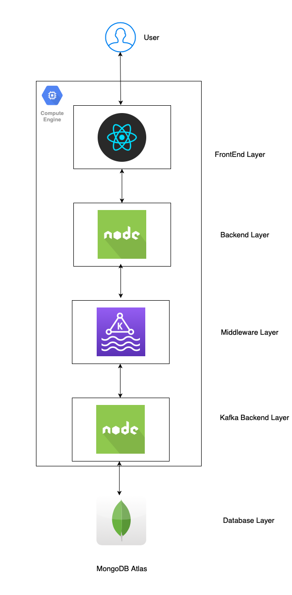

# Yelp Prototype

## Abstract

Yelp Prototype is a clone of the real [Yelp](https://www.yelp.com) app that concentrates on **Restaurant-Customer** relation where a restaurant lists dishes and user orders from it. The restaurants can register, login, update profile, add/update dishes, and add future events. The users can register, login, update profile, search for restaurants, order from restaurants, review restaurants, and register for events. The application has functionalities like search/filter/sort restaurants based on delivery methods and ratings, orders filtering for both restaurants and users, and sort events by date. To enhance user experience of the app, **client-side pagination** is used for listing of restaurant dishes and events. The app also has **Google Maps** embadded in it so that just by a click, a user would get the direction. One of the highlighting features of the app is its real-time chat system which is developed using **socket programming** where only a restaurant can initiate the chat and user can reply back. For Backend, each route is secured thanks to [PassportJS](http://www.passportjs.org) and [JWT](https://jwt.io) where only an authorized user can consume a particular backend route.

## Architecture


## Testing

The application is developed following `Test-Driven Development` approach where each module is unit tested. The Backend unit tests are created using [Chai](https://www.chaijs.com) and [Mocha](https://mochajs.org) frameworks. The Frontend unit tests are created in [Enzyme](https://github.com/enzymejs/enzyme) and [Jest](https://jestjs.io). [JMeter](https://jmeter.apache.org) is used to test the performance of the application under hundreds of concurrent requests load.

## Output
[Yelp Prototype](https://youtu.be/n9luq99MwA4)

## Steps to run the application

### Using Docker

1. Use `docker-compose.yml` file to build and run the application. The file builds and creates two docker containers, one for `backend` and the other for `frontend`.

2. To deploy the application on server, provide a root level `.env` with appropriate values. For example,

```
BACKEND_URL="http://localhost"
FRONTEND_URL="http://localhost"
BACKEND_PORT=3001
FRONTEND_PORT=3000
```

2. Build the images

```
docker-compose build
```

3. Run the application

```
docker-compose up
```

### Run locally without docker

1. Install necesary node modules for both frontend and backend

```
cd backend
npm i
cd ../frontend
npm i
```

2. Start frontend and backend server

```
cd backend
npm start
cd ../frontend
npm start
```

## Technology Stack

#### Backend
* NodeJS
* PassportJS
* Kafka
* JSON Web Tokens
* Chai
* Mocha
* MongoDB

#### Frontend
* ReactJS
* Redux
* Bootstrap
* Enzyme
* Jest

#### Deployment
* Docker-compose
* GCP

## References

* https://nodejs.org/en/
* https://reactjs.org
* http://www.passportjs.org
* https://mochajs.org
* https://github.com/enzymejs/enzyme
* https://www.mongodb.com
* https://redux.js.org
* https://docs.docker.com/compose/
* https://cloud.google.com/compute/docs/instances
